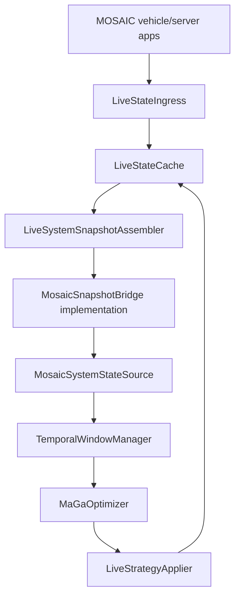
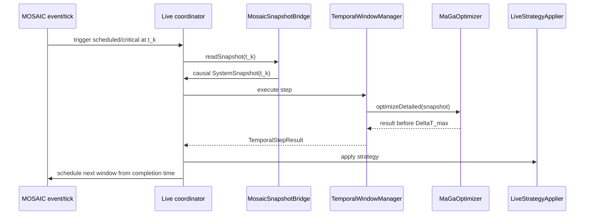
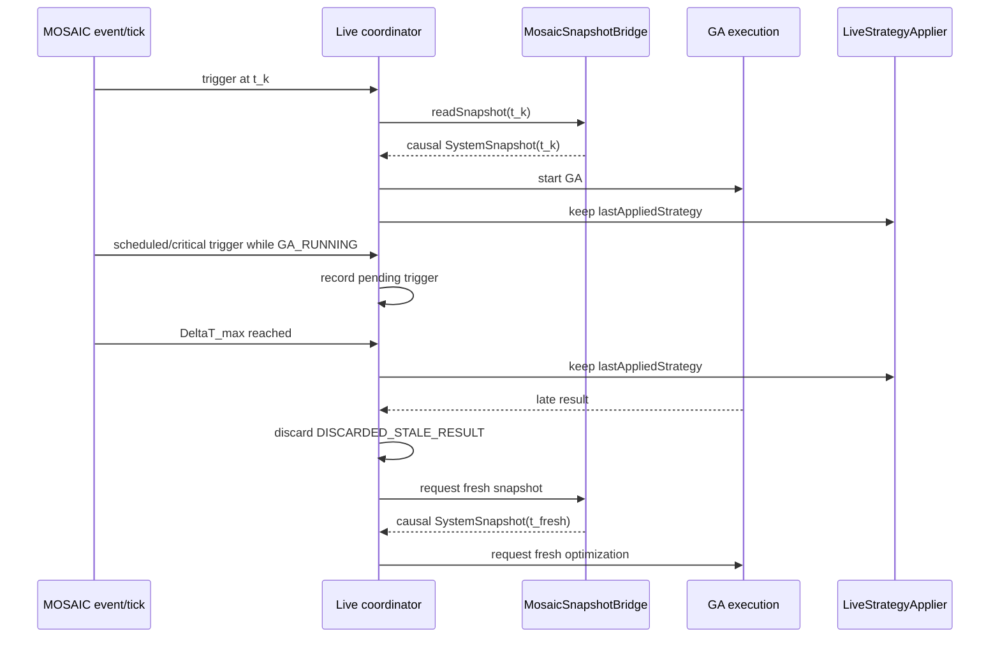
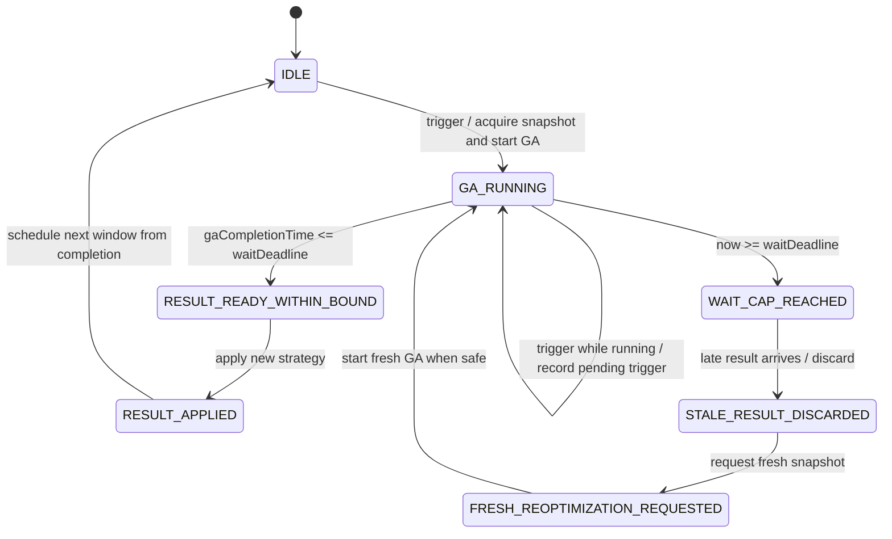

# Fase 12 - Progettazione verificata del bridge live MOSAIC -> MA-GA

## 1. Obiettivo

Questa fase progetta, senza implementarlo, il bridge live:

```text
MOSAIC runtime
  -> eventi e dati osservabili
  -> cache runtime causale
  -> MosaicSnapshotBridge
  -> MosaicSystemStateSource
  -> TemporalWindowManager
  -> SystemSnapshot
  -> MaGaOptimizer
  -> strategia di offloading
```

La Fase 12 e' architetturale: non modifica `src/`, non crea applicazioni MOSAIC runtime definitive, non introduce worker GA, non modifica scenari o exporter.

## 2. Stato iniziale

Fonte prevalente locale recente:

- `data/docs/mosaic-study/11_offline_pipeline_end_to_end_consolidation.md`
- `data/docs/mosaic-study/10_punto_10_sviluppo_completo.md`

Baseline canonica:

```text
sourceRun = log-20260604-220216-MaGaIntegratedStudy
phase11Status = COMPLETED
readyForPhase12 = true
```

La pipeline offline consolidata e':

```text
run MOSAIC registrata
  -> exporter offline
  -> SystemSnapshot JSON
  -> validator Java
  -> JSON_SEQUENCE replay
  -> JSON_TIME full-horizon replay
```

Nota di audit: nella workspace corrente risultano versionati i documenti Fase 10-11 e i log sotto `data/mosaic-study/diagnostics/phase_11/logs/`, ma non i manifest JSON Fase 11. La fonte prevalente per lo stato Fase 11 resta il documento locale Fase 11, coerente con il requisito operativo ricevuto.

## 3. Vincoli

Vincoli rispettati:

- nessuna modifica a `src/`;
- nessuna modifica a fitness, repair, mutation, crossover, DTO snapshot, `TemporalWindowManager`, `MosaicSnapshotBridge`, `MosaicSystemStateSource`;
- nessun bridge live concreto;
- nessuna app MOSAIC runtime definitiva;
- nessun executor, thread worker o scheduler runtime implementato;
- nessun `git add`, `git commit`, `git push`;
- nessuna riesecuzione MOSAIC.

## 4. Classi core ispezionate

Ispezionate in sola lettura:

```text
src/window/source/MosaicSnapshotBridge.java
src/window/source/MosaicSystemStateSource.java
src/window/source/SystemStateSource.java
src/window/source/SystemStateSourceMode.java
src/window/source/SystemStateRequest.java
src/window/source/SystemStateObservation.java
src/window/source/SystemStateSourceFactory.java
src/window/source/FilteringSystemStateSource.java
src/window/core/TemporalWindowManager.java
src/window/state/TemporalWindowState.java
src/window/state/TemporalStepResult.java
src/window/state/TemporalWindowResult.java
src/window/timing/AdaptiveWindowController.java
src/window/timing/AdaptiveWindowDecision.java
src/window/timing/TemporalWindowBounds.java
src/window/timing/TemporalWindowBoundsCalculator.java
src/window/timing/TemporalOperationalMetrics.java
src/window/timing/CoverageReferenceCalculator.java
src/window/trigger/ReoptimizationTrigger.java
src/window/event/CriticalEventDetector.java
src/window/event/StaticCriticalEventDetector.java
src/ga/core/MaGaOptimizer.java
src/ga/core/MaGaResult.java
src/model/snapshot/SystemSnapshot.java
src/model/snapshot/VehicleSnapshot.java
src/model/snapshot/TaskInstance.java
src/model/snapshot/AccessGatewaySnapshot.java
src/model/snapshot/AccessLinkSnapshot.java
src/model/snapshot/BandwidthPoolSnapshot.java
src/model/node/NodeCandidate.java
src/model/node/NodeType.java
src/model/bandwidth/BandwidthPoolResolver.java
src/model/bandwidth/BandwidthPoolType.java
src/model/mobility/AccessLinkResolver.java
src/model/mobility/AccessLinkMetricsEstimator.java
src/model/mobility/CoverageEstimator.java
src/validation/snapshot/SnapshotValidator.java
```

Ricostruzione core:

- `MosaicSnapshotBridge.readSnapshot(double observationTimeSeconds)` e' il contratto minimo; restituisce `Optional<SystemSnapshot>`.
- `MosaicSystemStateSource.nextObservation(request)` passa `requestedObservationTimeSeconds` al bridge e produce `SystemStateObservation`.
- Il tempo richiesto dal manager e' `trigger.getTriggerTimeSeconds() + dataCollectionDelaySeconds`.
- Il tempo sorgente e' `snapshot.getTimeSeconds()`, riportato in `SystemStateObservation.getSourceObservationTimeSeconds()`.
- `SystemStateObservation` distingue `observedSnapshot` da `optimizationSnapshot`.
- `FilteringSystemStateSource` applica il prefilter solo alla vista di ottimizzazione.
- `TemporalWindowManager` calcola dinamicita' e bounds sullo snapshot osservato, poi invoca il GA sullo snapshot filtrato.
- Il runtime GA corrente e' misurato con `System.nanoTime()` attorno a `optimizer.optimizeDetailed(...)`.
- `TemporalWindowState.afterStep(...)` avanza a `stepResult.getLogicalObservationTimeSeconds()` e programma `currentTime + nextWindowDuration`.
- Il riuso popolazione e' deciso da `PopulationReuseDecisionPolicy` e applicato da `PopulationAdapter`.
- I trigger schedulati sono `ReoptimizationTrigger.scheduledExpiration(...)`.
- I trigger critici arrivano da `CriticalEventDetector.findNextCriticalEvent(...)`.

## 5. Strumenti MOSAIC ispezionati

Ispezionati:

```text
tools/mosaic-cell-traffic-diagnostic/
tools/mosaic-adhoc-radio-diagnostic/
tools/mosaic-offline-exporter/
tools/deploy-mosaic-scenarios.ps1
data/mosaic-scenarios/MaGaIntegratedStudy/
```

Risultato:

- `MaGaCellTrafficDiagnosticVehicleApp` abilita Cell e invia traffico controllato verso `server_0`.
- `MaGaCellTrafficDiagnosticServerApp` riceve richieste e risponde via Cell.
- `MaGaAdHocRadioDiagnosticApp` abilita una radio ad-hoc `SINGLE` e non invia messaggi V2X.
- `mapping_config.json` definisce 12 veicoli, 2 RSU, 1 server e le app diagnostiche.
- `ma_ga_resource_catalog.json` definisce gateway, pool gateway, nodi EDGE/CLOUD, CPU locale diagnostica e policy V2V.
- `sns_config.json` definisce `singlehopRadius = 709.4` e delay single-hop.
- `cell_config.json`, `network.json`, `regions.json` definiscono misure Cell, capacita' e regioni.
- `deploy-mosaic-scenarios.ps1` copia scenari versionabili nel runtime locale; non e' parte del bridge live.

Separazione obbligatoria:

```text
strumento diagnostico offline != applicazione runtime definitiva
applicazione runtime != bridge live
bridge live != cache runtime
cache runtime != assembler SystemSnapshot
```

## 6. JAR MOSAIC ispezionati

Classpath locale reale:

```text
tmp/mosaic-25.2/lib/mosaic/*.jar
tmp/mosaic-25.2/lib/third-party/*.jar
```

JAR principali ispezionati:

```text
mosaic-application-25.2.jar
mosaic-objects-25.2.jar
mosaic-geomath-25.2.jar
mosaic-utils-25.2.jar
mosaic-interactions-25.2.jar
mosaic-cell-25.2.jar
mosaic-sns-25.2.jar
mosaic-output-25.2.jar
mosaic-communication-25.2.jar
```

Comandi informativi eseguiti:

```powershell
jar tf tmp/mosaic-25.2/lib/mosaic/mosaic-application-25.2.jar
jar tf tmp/mosaic-25.2/lib/mosaic/mosaic-objects-25.2.jar
jar tf tmp/mosaic-25.2/lib/mosaic/mosaic-geomath-25.2.jar
jar tf tmp/mosaic-25.2/lib/mosaic/mosaic-utils-25.2.jar
jar tf tmp/mosaic-25.2/lib/mosaic/mosaic-interactions-25.2.jar
jar tf tmp/mosaic-25.2/lib/mosaic/mosaic-cell-25.2.jar
jar tf tmp/mosaic-25.2/lib/mosaic/mosaic-sns-25.2.jar
javap -classpath ... org.eclipse.mosaic.fed.application.app.api.Application
javap -classpath ... org.eclipse.mosaic.lib.util.scheduling.EventProcessor
javap -classpath ... org.eclipse.mosaic.fed.application.app.AbstractApplication
javap -classpath ... org.eclipse.mosaic.fed.application.app.api.VehicleApplication
javap -classpath ... org.eclipse.mosaic.fed.application.app.api.CommunicationApplication
javap -classpath ... org.eclipse.mosaic.fed.application.app.api.os.OperatingSystem
javap -classpath ... org.eclipse.mosaic.fed.application.app.api.os.VehicleOperatingSystem
javap -classpath ... org.eclipse.mosaic.fed.application.app.api.os.RoadSideUnitOperatingSystem
javap -classpath ... org.eclipse.mosaic.fed.application.app.api.os.ServerOperatingSystem
javap -classpath ... org.eclipse.mosaic.lib.objects.vehicle.VehicleData
javap -classpath ... org.eclipse.mosaic.lib.objects.UnitData
javap -classpath ... org.eclipse.mosaic.lib.geo.GeoPoint
javap -classpath ... org.eclipse.mosaic.lib.geo.CartesianPoint
javap -classpath ... org.eclipse.mosaic.lib.util.scheduling.Event
javap -classpath ... org.eclipse.mosaic.lib.util.scheduling.EventManager
javap -classpath ... org.eclipse.mosaic.fed.application.app.api.os.modules.AdHocCommunicative
javap -classpath ... org.eclipse.mosaic.fed.application.ambassador.simulation.communication.AdHocModule
javap -classpath ... org.eclipse.mosaic.fed.application.app.api.os.modules.CellCommunicative
javap -classpath ... org.eclipse.mosaic.fed.application.ambassador.simulation.communication.CellModule
javap -classpath ... org.eclipse.mosaic.fed.application.ambassador.simulation.communication.CellModuleConfiguration
javap -classpath ... org.eclipse.mosaic.fed.application.ambassador.simulation.communication.ReceivedV2xMessage
javap -classpath ... org.eclipse.mosaic.interactions.communication.CellularHandoverUpdates
javap -classpath ... org.eclipse.mosaic.lib.objects.communication.CellConfiguration
javap -classpath ... org.eclipse.mosaic.lib.objects.communication.HandoverInfo
```

Nota Windows: diversi `javap` hanno stampato la firma utile e poi `AccessDeniedException` in chiusura JAR. La diagnosi API usa le firme stampate, non un'esecuzione runtime.

Fonti ufficiali consultate:

- Eclipse MOSAIC JavaDocs 25.2 `VehicleApplication`: <https://eclipse.dev/mosaic/java_docs/org/eclipse/mosaic/fed/application/app/api/VehicleApplication.html>
- Eclipse MOSAIC JavaDocs 25.2 `VehicleData`: <https://eclipse.dev/mosaic/java_docs/org/eclipse/mosaic/lib/objects/vehicle/VehicleData.html>
- Eclipse MOSAIC docs `Event Scheduling`: <https://eclipse.dev/mosaic/docs/develop_applications/event_scheduling/>
- Eclipse MOSAIC docs `Cell Simulator - Basic Configuration`: <https://eclipse.dev/mosaic/docs/mosaic_configuration/cell_config/>

## 7. API inventory

| Classe | Metodo / firma verificata | JAR sorgente | Disponibile | Uso previsto | Limiti |
| --- | --- | --- | --- | --- | --- |
| `Application` | `void onStartup()`, `void onShutdown()` | `mosaic-application-25.2.jar` | si | lifecycle app | nessun dato dominio da solo |
| `EventProcessor` | `void processEvent(Event) throws Exception` | `mosaic-utils-25.2.jar` | si | tick coordinatore | scheduling logico, non worker |
| `VehicleApplication` | `void onVehicleUpdated(VehicleData, VehicleData)` | `mosaic-application-25.2.jar` | si | telemetria veicolo live | solo app veicolo |
| `OperatingSystem` | `long getSimulationTime()` | `mosaic-application-25.2.jar` | si | tempo logico MOSAIC | nanosecondi, da convertire |
| `OperatingSystem` | `EventManager getEventManager()` | `mosaic-application-25.2.jar` | si | scheduling eventi | thread-safety non provata |
| `EventManager` | `void addEvent(Event)` | `mosaic-utils-25.2.jar` | si | prossimo tick | non risolve GA asincrono |
| `Event` | `Event(long, EventProcessor)` | `mosaic-utils-25.2.jar` | si | tick programmato | payload opzionale solo locale |
| `VehicleOperatingSystem` | `VehicleData getVehicleData()` | `mosaic-application-25.2.jar` | si | stato corrente veicolo | app veicolo |
| `VehicleData` | `CartesianPoint getProjectedPosition()` | `mosaic-objects-25.2.jar` | si | `x/y` live | usare se non nullo |
| `VehicleData` | `double getSpeed()` | `mosaic-objects-25.2.jar` | si | velocita' | scalare |
| `VehicleData` | `Double getHeading()` | `mosaic-objects-25.2.jar` | si | heading opzionale | non entra nel DTO corrente |
| `UnitData` | `GeoPoint getPosition()` | `mosaic-objects-25.2.jar` | si | lat/lon | non usare per distanze metriche se projected presente |
| `GeoPoint` | `getLatitude()`, `getLongitude()` | `mosaic-geomath-25.2.jar` | si | coordinate geografiche | DTO `VehicleSnapshot` non le contiene |
| `CartesianPoint` | `getX()`, `getY()` | `mosaic-geomath-25.2.jar` | si | coordinate metriche | fonte preferita live |
| `AdHocCommunicative` | `AdHocModule getAdHocModule()` | `mosaic-application-25.2.jar` | si | accesso radio ad-hoc | nessuna reachability peer |
| `AdHocModule` | `enable(...)`, `disable()`, `boolean isEnabled()` | `mosaic-application-25.2.jar` | si | stato radio locale | non espone banda residua |
| `CellCommunicative` | `CellModule getCellModule()` | `mosaic-application-25.2.jar` | si | accesso Cell | nessuna regione live |
| `CellModule` | `enable(...)`, `disable()`, `boolean isEnabled()`, `sendV2xMessage(...)` | `mosaic-application-25.2.jar` | si | traffico/app Cell | non espone bucket o traffico |
| `CellModuleConfiguration` | `maxDownlinkBitrate`, `maxUplinkBitrate`, getter max bitrate | `mosaic-application-25.2.jar` | si | configurazione nominale app | non misura residuo |
| `ReceivedV2xMessage` | `getMessage()`, `getReceiverInformation()`, `getTime()` | `mosaic-application-25.2.jar` | si | ricezione messaggi | non prova reachability V2V generale |
| `CellularHandoverUpdates` | `getUpdated()` | `mosaic-interactions-25.2.jar` | parziale | evento federate/output | non callback app ordinaria |
| `CellConfiguration` | `getAvailableDownlinkBitrate()`, `getAvailableUplinkBitrate()` | `mosaic-objects-25.2.jar` | parziale | stato oggetto comunicazione | non accessibile direttamente da `CellModule` app |
| `mosaic-cell` utilities | `RegionUtility`, `RegionCapacityUtility`, `BandwidthMeasurementManager` | `mosaic-cell-25.2.jar` | interno | possibile indizio per adapter | non API applicativa |

## 8. Matrice disponibilita' dati

| Dato snapshot / runtime | Categoria | Fonte / adapter minimo |
| --- | --- | --- |
| simulation time | OBSERVED_DIRECTLY_FROM_MOSAIC_API | `getOs().getSimulationTime()` |
| vehicleId | OBSERVED_DIRECTLY_FROM_MOSAIC_API | `getOs().getId()` / `VehicleData.getName()` |
| vehicle active state | DERIVED_CAUSALLY_AT_SNAPSHOT_TIME | lifecycle cache startup/update/shutdown |
| projected x | OBSERVED_DIRECTLY_FROM_MOSAIC_API | `VehicleData.getProjectedPosition().getX()` |
| projected y | OBSERVED_DIRECTLY_FROM_MOSAIC_API | `VehicleData.getProjectedPosition().getY()` |
| latitude | OBSERVED_DIRECTLY_FROM_MOSAIC_API | `VehicleData.getPosition().getLatitude()` |
| longitude | OBSERVED_DIRECTLY_FROM_MOSAIC_API | `VehicleData.getPosition().getLongitude()` |
| speed | OBSERVED_DIRECTLY_FROM_MOSAIC_API | `VehicleData.getSpeed()` |
| heading | OBSERVED_DIRECTLY_FROM_MOSAIC_API | `VehicleData.getHeading()`; DTO attuale non lo consuma |
| task activation | OBSERVED_FROM_EXISTING_DIAGNOSTIC_APP / REQUIRES_PHASE_13_RUNTIME_ADAPTER | app workload live |
| task profile | CONFIGURED_IN_VERSIONED_RESOURCE_CATALOG | `ma_ga_workload_config.json` |
| local CPU | CONFIGURED_IN_VERSIONED_RESOURCE_CATALOG / REQUIRES_FUTURE_CALIBRATION | `ma_ga_resource_catalog.json` |
| ad-hoc radio state | OBSERVED_DIRECTLY_FROM_MOSAIC_API / OBSERVED_FROM_EXISTING_DIAGNOSTIC_APP | `AdHocModule.isEnabled()`; offline `ADHOC_CONFIGURATION` |
| V2V reachability | DERIVED_CAUSALLY_AT_SNAPSHOT_TIME | radio attiva + distanza <= radius |
| single-hop radius | CONFIGURED_IN_VERSIONED_RESOURCE_CATALOG | `sns_config.json` |
| V2V bandwidth | CONFIGURED_IN_VERSIONED_RESOURCE_CATALOG / REQUIRES_FUTURE_CALIBRATION | catalogo V2V |
| V2V propagation delay | CONFIGURED_IN_VERSIONED_RESOURCE_CATALOG / REQUIRES_FUTURE_CALIBRATION | SNS/catalogo |
| RSU gateway static data | CONFIGURED_IN_VERSIONED_RESOURCE_CATALOG | mapping + catalogo |
| gateway physical position | CONFIGURED_IN_VERSIONED_RESOURCE_CATALOG | mapping; proiezione live non necessaria se catalogo include x/y |
| gateway coverage radius | CONFIGURED_IN_VERSIONED_RESOURCE_CATALOG | catalogo |
| Cell region | NOT_YET_AVAILABLE_LIVE / REQUIRES_PHASE_13_RUNTIME_ADAPTER | non esposta da `CellModule` app |
| Cell handover | OBSERVED_FROM_EXISTING_DIAGNOSTIC_APP / REQUIRES_PHASE_13_RUNTIME_ADAPTER | output `CELLULAR_HANDOVER`; adapter runtime |
| Cell traffic bucket | NOT_YET_AVAILABLE_LIVE / REQUIRES_PHASE_13_RUNTIME_ADAPTER | `bandwidthMeasurements` offline; live adapter |
| Cell uplink residual bandwidth | NOT_YET_AVAILABLE_LIVE / REQUIRES_PHASE_13_RUNTIME_ADAPTER | bucket Cell sicuro |
| Cell downlink residual bandwidth | NOT_YET_AVAILABLE_LIVE / REQUIRES_PHASE_13_RUNTIME_ADAPTER | bucket Cell sicuro |
| latest safe Cell bucket | DERIVED_CAUSALLY_AT_SNAPSHOT_TIME / REQUIRES_PHASE_13_RUNTIME_ADAPTER | cache Cell con `availableFrom <= t` |
| EDGE execution node | CONFIGURED_IN_VERSIONED_RESOURCE_CATALOG | catalogo |
| CLOUD execution node | CONFIGURED_IN_VERSIONED_RESOURCE_CATALOG | catalogo |
| access link | DERIVED_CAUSALLY_AT_SNAPSHOT_TIME | geometria veicolo-gateway al tempo `t` |
| LOCAL candidate | DERIVED_CAUSALLY_AT_SNAPSHOT_TIME | un candidato per veicolo attivo |
| VEHICLE candidate | DERIVED_CAUSALLY_AT_SNAPSHOT_TIME | peer diretti single-hop |
| EDGE candidate | DERIVED_CAUSALLY_AT_SNAPSHOT_TIME | gateway attivo + nodo EDGE |
| CLOUD candidate | DERIVED_CAUSALLY_AT_SNAPSHOT_TIME | gateway attivo + nodo CLOUD |
| gateway bandwidth pool | DERIVED_CAUSALLY_AT_SNAPSHOT_TIME / REQUIRES_PHASE_13_RUNTIME_ADAPTER | ultimo bucket Cell sicuro |
| DIRECT_V2V pool | DERIVED_CAUSALLY_AT_SNAPSHOT_TIME | una pool per coppia diretta inclusa |
| pending task set | DERIVED_CAUSALLY_AT_SNAPSHOT_TIME / REQUIRES_PHASE_13_RUNTIME_ADAPTER | cache task live |
| last applied strategy | REQUIRES_PHASE_13_RUNTIME_ADAPTER | stato strategy applier |
| GA in-flight state | REQUIRES_PHASE_13_RUNTIME_ADAPTER | coordinator state |
| GA completion state | REQUIRES_PHASE_13_RUNTIME_ADAPTER | coordinator state |

## 9. Architettura proposta

Decisione raccomandata:

```text
architecturePolicy = CENTRALIZED_LIVE_COORDINATOR_WITH_CAUSAL_CACHE
```

Flusso:

```text
MOSAIC vehicle-side runtime apps
  -> telemetry e task events
  -> LiveStateIngress
  -> LiveStateCache
  -> LiveSystemSnapshotAssembler
  -> MosaicSnapshotBridge implementation
  -> MosaicSystemStateSource
  -> TemporalWindowManager
  -> MaGaOptimizer
  -> LiveStrategyApplier
```

Motivazione: un coordinatore centralizzato mantiene una vista causale unica, evita GA sovrapposti, costruisce snapshot completi e conserva l'ultima strategia valida.

## 10. Componenti runtime

| Componente provvisorio | Responsabilita' | Input | Output | Stato | Thread model | Tempo logico | Dipendenze |
| --- | --- | --- | --- | --- | --- | --- | --- |
| `MaGaVehicleTelemetryApp` | osservare `onVehicleUpdated` | `VehicleData` | telemetry event | nessuno persistente oltre cache | callback MOSAIC | `getSimulationTime()` | Vehicle API |
| `MaGaTaskGenerationApp` | generare/registrare task | profili workload | task activation event | contatori task per veicolo | callback/eventi MOSAIC | activation time | config workload |
| `MaGaCoordinatorApp` | orchestrare trigger e snapshot | eventi/tick/cache | richiesta GA/strategia | trigger pendenti, ultimo stato GA | Fase 13 da decidere | simulation time | EventManager + core |
| `MaGaLiveStateCache` | mantenere cache causali | ingress events | query latest <= t | mappe veicoli/task/radio/cell | single-thread callback o lock da decidere | sourceTime/availableFrom | nessuna modifica core |
| `MaGaLiveSnapshotAssembler` | costruire `SystemSnapshot` | cache + catalogo | snapshot valido | nessuno oltre contatori diagnostici | chiamato dal bridge | snapshotTime = t | DTO snapshot |
| `MaGaMosaicSnapshotBridge` | implementare `MosaicSnapshotBridge` | observationTime | `Optional<SystemSnapshot>` | riferimento cache/assembler | chiamata manager | requested time | core source |
| `MaGaLiveStrategyApplier` | applicare/pubblicare strategia | `MaGaResult` | comandi/log runtime | lastAppliedStrategy | Fase 13 | apply time | MOSAIC app APIs |
| `MaGaGaExecutionCoordinator` | impedire GA paralleli e gestire overrun | trigger/snapshot | result/apply/discard | state machine GA | Fase 13 aperta | simulation time + wall clock runtime | `TemporalWindowManager` |

Rischi principali:

- thread-safety dell'accesso API MOSAIC fuori callback non verificata;
- Cell live insufficiente senza adapter;
- strategia precedente puo' diventare stale durante overrun;
- CPU locale e banda V2V restano diagnostiche da calibrare.

## 11. Cache runtime

### 11.1 Cache veicoli

Campi:

```text
vehicleId
lastUpdateTime
projectedX
projectedY
latitude
longitude
speed
heading
active
adHocRadioActive
```

Policy:

```text
LATEST_OBSERVATION_AT_OR_BEFORE_SNAPSHOT_TIME
```

Usare `VehicleData.getProjectedPosition()` per `x/y` live. Non riconvertire lat/lon quando MOSAIC fornisce coordinate proiettate.

### 11.2 Cache task

Campi:

```text
taskId
sourceVehicleId
profileId
activationTime
inputSizeBits
outputSizeBits
cpuCycles
deadlineSeconds
status
```

Status minimi:

```text
PENDING
EXPORTED_TO_CURRENT_WINDOW
COMPLETED_OR_REMOVED
```

Policy:

```text
taskPendingPolicy = PENDING_TASKS_AT_NEXT_OPTIMIZATION_WINDOW
```

Il primo bridge non simula live migration.

### 11.3 Cache radio ad-hoc

Campi:

```text
vehicleId
radioState
availableFromTime
```

Policy:

```text
DIRECT_SINGLEHOP_ONLY
```

`V2X_MESSAGE_RECEPTION` non e' prova sufficiente di raggiungibilita'.

### 11.4 Cache Cell

Campi:

```text
regionId
direction
bucketStartTime
availableFromTime
nominalCapacity
trafficObserved
residualCapacity
```

Policy:

```text
bucketBoundaryPolicy = START_TIMESTAMP_FOR_INTERVAL
availableFromPolicy = SAFE_AFTER_TIMESTAMP
lookupPolicy = LATEST_SAFE_AVAILABLE_CELL_BUCKET
```

### 11.5 Infrastruttura statica

Campi:

```text
gateway RSU
gateway position
coverage radius
region binding
gateway pool
EDGE node
CLOUD node
catalog resource parameters
```

### 11.6 Stato strategie

Campi:

```text
lastAppliedStrategy
strategyAppliedAt
gaExecutionState
gaStartedAt
gaCompletedAt
gaResultFreshness
```

## 12. Snapshot causale al tempo t

Policy:

```text
snapshotAssemblyPolicy = CAUSAL_LATEST_AVAILABLE_DATA_AT_OR_BEFORE_REQUESTED_TIME
snapshotTime = t
```

Lo snapshot puo' usare solo dati con:

```text
sourceTime <= t
availableFromTime <= t
```

Regole:

- `vehicles`: veicoli attivi dalla cache latest <= t.
- `tasks`: task pendenti attivati <= t e non consumati dalla policy corrente.
- `accessGateways`: infrastruttura statica.
- `accessLinks`: derivati da veicoli e gateway validi al tempo t.
- `LOCAL`: uno per veicolo attivo.
- `VEHICLE`: source != target, entrambi attivi, radio attiva, distanza <= radius.
- `EDGE`: solo se gateway attivo risolvibile.
- `CLOUD`: solo se gateway attivo risolvibile.
- `gateway pools`: ultimo bucket Cell sicuro.
- `DIRECT_V2V pools`: solo coppie dirette incluse.

Nessun placeholder.

## 13. Task pending

La politica live eredita la semantica Fase 10H:

```text
PENDING_TASKS_AT_NEXT_OPTIMIZATION_WINDOW
```

Un task diventa esportabile quando `activationTime <= snapshotTime`. Per il primo bridge, dopo l'esportazione alla finestra corrente passa a `EXPORTED_TO_CURRENT_WINDOW` e non viene ripetuto fino a nuova decisione di policy in Fase 13.

## 14. LOCAL

Un candidato `LOCAL` e' generato per ogni veicolo attivo:

```text
sourceVehicleId == executionNodeId
type = LOCAL
propagationDelaySeconds = 0
availableCpu = catalog vehicle profile
```

Non richiede gateway.

## 15. V2V direct single-hop

Policy:

```text
v2vCandidatePolicy = DIRECT_SINGLEHOP_ONLY
```

Un peer e' candidabile se:

```text
source != target
AND source active
AND target active
AND source ad-hoc radio active
AND target ad-hoc radio active
AND distance(projected source, projected target) <= singlehopRadius
```

Non usare multi-hop e non generare traffico V2X per scoprire peer.

## 16. EDGE

Un candidato EDGE e' generato solo se:

```text
source vehicle active
gateway active and resolvable
EDGE node bound to that gateway
gateway bandwidth pool safe at t
```

## 17. CLOUD

Un candidato CLOUD e' generato solo tramite gateway attivo:

```text
CLOUD accessPolicy = THROUGH_ACTIVE_GATEWAY
no legacy stable cloud placeholder
```

## 18. Cell latest safe bucket

La Fase 12 non trova una API applicativa sufficiente per leggere direttamente traffico/bucket/residui Cell live. La policy resta:

```text
cellBandwidthPolicy = LATEST_SAFE_AVAILABLE_CELL_BUCKET
availableBandwidth = min(uplinkResidualBandwidth, downlinkResidualBandwidth)
```

Serve un adapter Fase 13 per popolare la cache Cell senza look-ahead.

## 19. Projected position live

`VehicleData.getProjectedPosition()` e' disponibile nei JAR locali e nelle JavaDocs. Quindi:

```text
vehiclePositionPolicy = MOSAIC_PROJECTED_POSITION_WHEN_AVAILABLE
```

Lat/lon restano osservabili e diagnostiche, ma le distanze del bridge live devono usare x/y proiettate.

## 20. Gateway opzionale

Policy:

```text
optionalGatewayPolicy = LOCAL_AND_V2V_WITHOUT_GATEWAY_EDGE_AND_CLOUD_STRICT
```

Questo e' coerente con `SnapshotValidator`, `AccessLinkResolver` e i report Fasi 10-11.

## 21. Trigger

Regole:

- scheduled expiration mentre GA e' `IDLE`: richiedi snapshot e avvia GA.
- critical event mentre GA e' `IDLE`: richiedi snapshot e avvia GA.
- trigger mentre GA e' `GA_RUNNING`: non avviare secondo GA; registra trigger pendente.
- priorita' trigger pendenti: `GA_TIMEOUT_DELTA_T_MAX` > critical event > scheduled expiration.
- dopo completamento o timeout, rivalutare sempre sullo stato piu' fresco disponibile.

## 22. Runtime GA

Il core corrente esegue GA in modo sincrono dentro `TemporalWindowManager.executeNextStepOrNull(...)`. Il live bridge deve decidere in Fase 13 se:

- eseguire il GA nel callback MOSAIC;
- usare un worker asincrono;
- proibire chiamate MOSAIC API dal worker e usare solo snapshot immutabili;
- cancellare o solo marcare stale un risultato tardivo.

La Fase 12 non implementa worker.

## 23. Policy DeltaT_max

Policy approvata:

```text
liveGaOverrunPolicy =
  DEFER_NEXT_WINDOW_UNTIL_GA_COMPLETES_CAPPED_BY_DELTA_T_MAX
strategyWhileGaRunningPolicy =
  KEEP_LAST_APPLIED_STRATEGY
parallelGaPolicy =
  SINGLE_IN_FLIGHT_GA_ONLY
lateResultPolicy =
  DISCARD_RESULT_IF_COMPLETED_AFTER_DELTA_T_MAX
postTimeoutRecoveryPolicy =
  REQUEST_FRESH_SNAPSHOT_AND_REOPTIMIZE_AT_FIRST_SAFE_INSTANT
```

Al tempo `t_k`:

```text
waitDeadline(k) = t_k + DeltaT_max(k)
```

Usare il `DeltaT_max(k)` reale calcolato in `TemporalWindowBounds`, non confonderlo automaticamente con `configuredMaxWindowSeconds`.

## 24. Risultato stale

Se:

```text
gaCompletionTime > waitDeadline(k)
```

allora:

- non applicare il risultato;
- registrare `GA_TIMEOUT_DELTA_T_MAX`;
- registrare `DISCARDED_STALE_RESULT`;
- mantenere `lastAppliedStrategy`;
- richiedere snapshot fresco.

## 25. Strategia precedente

Durante `GA_RUNNING`, `WAIT_CAP_REACHED` e `STALE_RESULT_DISCARDED` resta attiva:

```text
lastAppliedStrategy
```

Warning:

```text
WARNING_REUSED_STRATEGY_MAY_BECOME_STALE_DURING_GA_OVERRUN
```

La policy evita buchi decisionali, ma puo' mantenere temporaneamente una strategia non ottimale rispetto allo stato corrente.

## 26. No parallel GA

Il coordinatore live deve mantenere:

```text
parallelGaPolicy = SINGLE_IN_FLIGHT_GA_ONLY
```

Ogni trigger ricevuto mentre il GA e' running diventa pendente.

## 27. Worker model aperto

Decisione Fase 13:

- callback sincrono semplice ma rischioso per simulazione;
- worker asincrono migliore per non bloccare MOSAIC ma richiede snapshot immutabili e thread-safety cache;
- cancellazione GA non provata dal core corrente;
- scarto risultato tardivo e' piu' semplice della cancellazione hard.

## 28. Thread safety

Non e' stata trovata prova che le API runtime MOSAIC siano thread-safe fuori callback. Decisione raccomandata:

- le app MOSAIC scrivono cache solo nel thread callback/evento MOSAIC;
- eventuale worker GA riceve solo `SystemSnapshot` immutabilizzato/copiat;
- l'applicazione strategia torna su evento MOSAIC schedulato.

La decisione concreta resta `DECISION_REQUIRED_BEFORE_PHASE_13`.

## 29. Diagramma componenti



## 30. Sequenza normale



## 31. Sequenza overrun



## 32. Macchina a stati



## 33. Classi future

Struttura proposta per Fase 13:

| Package | Classe provvisoria | Responsabilita' | Input | Output | Dipendenze | Stato | Test necessari |
| --- | --- | --- | --- | --- | --- | --- | --- |
| `mosaic.bridge` | `MaGaMosaicSnapshotBridge` | implementa `MosaicSnapshotBridge` | requested time | `SystemSnapshot` | assembler | stateless | readSnapshot causal |
| `mosaic.cache` | `MaGaLiveStateCache` | cache causale | ingress events | query latest | none/core DTO | stateful | no-look-ahead |
| `mosaic.cache` | `VehicleTelemetryRecord` | record veicolo | `VehicleData` | DTO cache | MOSAIC API | immutable | projected position |
| `mosaic.cache` | `TaskRuntimeRecord` | record task | task event | DTO cache | workload config | stateful status | pending policy |
| `mosaic.cache` | `CellBandwidthBucket` | bucket Cell | adapter Cell | safe bucket | Cell adapter | immutable | availableFrom <= t |
| `mosaic.assembler` | `MaGaLiveSystemSnapshotAssembler` | crea snapshot | cache/cataloghi | `SystemSnapshot` | DTO/core validators | stateless | SnapshotValidator |
| `mosaic.runtime` | `MaGaVehicleTelemetryApp` | osserva veicoli | callbacks | ingress telemetry | Vehicle API | app-local | onVehicleUpdated |
| `mosaic.runtime` | `MaGaTaskGenerationApp` | attiva task | scheduler | task events | EventManager | app-local | activation exact |
| `mosaic.runtime` | `MaGaCoordinatorApp` | coordina trigger | cache/tick | GA request | EventManager/core | stateful | trigger priority |
| `mosaic.runtime` | `MaGaGaExecutionCoordinator` | gestisce GA in-flight | snapshot | apply/discard | manager | stateful | overrun states |
| `mosaic.strategy` | `MaGaLiveStrategyApplier` | applica strategia | `MaGaResult` | runtime action | MOSAIC APIs | last strategy | keep/apply/discard |
| `mosaic.config` | `MaGaLiveBridgeConfig` | carica cataloghi | JSON scenario | config typed | standard parser | immutable | validation |
| `mosaic.diagnostics` | `MaGaLiveBridgeDiagnostics` | log diagnostici | state transitions | audit output | none | append-only | warnings/errors |

## 34. Classi riutilizzate

| Classe esistente | Decisione |
| --- | --- |
| `MosaicSnapshotBridge` | riuso diretto; implementazione esterna Fase 13 |
| `MosaicSystemStateSource` | riuso diretto, nessuna modifica prevista |
| `SystemStateRequest` | riuso diretto |
| `SystemStateObservation` | riuso diretto |
| `TemporalWindowManager` | riuso diretto per flusso sincrono; coordinamento live esterno |
| `SystemSnapshot` | riuso diretto |
| `SnapshotValidator` | riuso diretto in test/diagnostica |
| `BandwidthPoolResolver` | riuso diretto |
| `CoverageEstimator` | riuso diretto |
| `MaGaOptimizer` | riuso diretto |
| `AccessLinkResolver` | riuso diretto |
| `AccessLinkMetricsEstimator` | riuso diretto |

## 35. Alternative scartate

| Alternativa | Perche' non e' prima scelta |
| --- | --- |
| bridge distribuito per-veicolo | frammenta lo stato, rende difficile evitare GA sovrapposti e richiede consenso su snapshot globale |
| bridge basato soltanto su log | torna a un modello offline e non garantisce disponibilita' al tempo `t` |
| rigenerazione file JSON durante simulazione | aumenta I/O, introduce latenza e non serve dato che il core accetta `SystemSnapshot` in memoria |

## 36. Decisioni approvate

```text
CENTRALIZED_LIVE_COORDINATOR_WITH_CAUSAL_CACHE
MOSAIC_PROJECTED_POSITION_WHEN_AVAILABLE
CAUSAL_LATEST_AVAILABLE_DATA_AT_OR_BEFORE_REQUESTED_TIME
PENDING_TASKS_AT_NEXT_OPTIMIZATION_WINDOW
DIRECT_SINGLEHOP_ONLY
LATEST_SAFE_AVAILABLE_CELL_BUCKET
LOCAL_AND_V2V_WITHOUT_GATEWAY_EDGE_AND_CLOUD_STRICT
DEFER_NEXT_WINDOW_UNTIL_GA_COMPLETES_CAPPED_BY_DELTA_T_MAX
KEEP_LAST_APPLIED_STRATEGY
SINGLE_IN_FLIGHT_GA_ONLY
DISCARD_RESULT_IF_COMPLETED_AFTER_DELTA_T_MAX
REQUEST_FRESH_SNAPSHOT_AND_REOPTIMIZE_AT_FIRST_SAFE_INSTANT
```

## 37. Decisioni aperte

| Punto | Classificazione |
| --- | --- |
| task generation live definitiva | DECISION_REQUIRED_BEFORE_PHASE_13 |
| condivisione eventi tra app veicolo e coordinatore | DECISION_REQUIRED_BEFORE_PHASE_13 |
| gateway live vs static catalog only | DECISION_REQUIRED_BEFORE_PHASE_13 |
| handover Cell live | REQUIRES_RUNTIME_ADAPTER |
| banda Cell live | REQUIRES_RUNTIME_ADAPTER |
| stato radio ad-hoc: `isEnabled` vs evento config completo | API_VERIFICATION_REQUIRED |
| applicazione strategia in MOSAIC | DECISION_REQUIRED_BEFORE_PHASE_13 |
| runtime GA worker model | DECISION_REQUIRED_BEFORE_PHASE_13 |
| thread safety accesso API MOSAIC | API_VERIFICATION_REQUIRED |
| persistenza task remoti | OUT_OF_SCOPE |
| live migration | OUT_OF_SCOPE |
| checkpoint | OUT_OF_SCOPE |
| ripresa upload/download | OUT_OF_SCOPE |
| cicli CPU residui | OUT_OF_SCOPE |

## 38. Limiti

- Cell live non e' sufficiente con la sola API applicativa ispezionata.
- V2V bandwidth e CPU locale sono diagnostiche e richiedono calibrazione.
- Il core corrente non modella task remoti persistenti o live migration.
- Il worker model non e' risolto in Fase 12.
- La baseline Fase 11 valida struttura e causalita', non stressa l'offloading.

## 39. Roadmap Fase 13

| Step | Obiettivo | Classi previste | Input | Output | Test | Criterio uscita | Rischi |
| --- | --- | --- | --- | --- | --- | --- | --- |
| 13A | API probe e skeleton runtime | runtime probes | JAR/API | report | javap + smoke | firme confermate | thread safety ignota |
| 13B | cache telemetria veicoli | telemetry app/cache | `VehicleData` | cache vehicle | latest <= t | projected x/y validi | lifecycle |
| 13C | task activation runtime | task app/cache | workload config | pending tasks | boundary tests | task pendenti corretti | duplicati |
| 13D | infrastruttura statica/access link | config loader/assembler | cataloghi | gateways/links | validator | no placeholder | proiezione gateway |
| 13E | candidati LOCAL | assembler | vehicles/catalog | LOCAL | snapshot tests | uno per veicolo | CPU sintetica |
| 13F | radio ad-hoc/V2V | telemetry/radio cache | radio + vehicles | V2V/pool | distance tests | direct only | banda calibrabile |
| 13G | adapter Cell live | Cell adapter/cache | Cell events/buckets | safe buckets | no-look-ahead | residuali disponibili | API non diretta |
| 13H | candidati EDGE/CLOUD | assembler | links/nodes/buckets | remote candidates | strict gateway tests | no cloud placeholder | bucket mancanti |
| 13I | assembler snapshot | snapshot assembler | cache/catalog | `SystemSnapshot` | SnapshotValidator | snapshot valido | staleness |
| 13J | bridge concreto | `MaGaMosaicSnapshotBridge` | time | Optional snapshot | source tests | `MosaicSystemStateSource` funziona | timing |
| 13K | coordinatore GA/applier | coordinator/applier | trigger/result | strategy | trigger tests | no parallel GA | callback blocking |
| 13L | overrun DeltaT_max | GA coordinator | bounds/runtime | apply/discard | state machine tests | stale scartato | wall vs sim time |
| 13M | scenario MOSAIC live minimo | runtime apps | scenario | live run | smoke MOSAIC | snapshot live prodotto | deployment |
| 13N | confronto live vs offline | diagnostics | live/offline | diff report | regression | nessun look-ahead | tolleranze |

## 40. Criterio di uscita Fase 12

Fase 12 e' completata se:

- core ispezionato;
- tool MOSAIC ispezionati;
- JAR MOSAIC locali ispezionati con `jar tf`/`javap`;
- API inventory prodotto;
- matrice dati live completata;
- architettura centralizzata documentata;
- cache runtime definite;
- snapshot causale formalizzato;
- Cell live e V2V live trattati esplicitamente;
- policy overrun `DeltaT_max` e risultato stale formalizzati;
- decisioni aperte separate dalle approvate;
- roadmap Fase 13 creata;
- bridge live non implementato;
- errori bloccanti assenti.

Stato:

```text
phase12Status = COMPLETED
readyForPhase13 = true
bridge live implementato = no
core modificato = no
```
